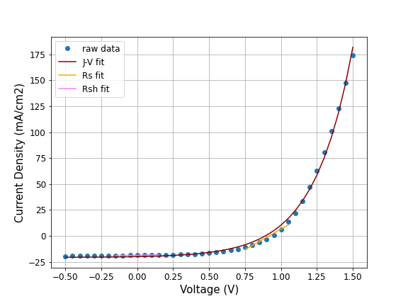

# About this project

During my PhD I measured the current-density vs. voltage curves for a wide variety of solar cells. For this project I am trying to look at handling some of that data, fitting these data with a model, and extracting performance parameters of the cell.

First, I tried using the ideal diode equation to fit my data:

$$J(V) = J_{D} (exp(A V) - 1) - J_{sc}$$

An example of the fitted data can be seen below:

As seen above, the fitted curve is less square-shaped than the raw data - meaning that the fit will underestimate the fill factor parameter of the solar cell. 