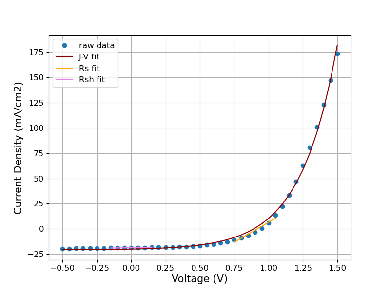
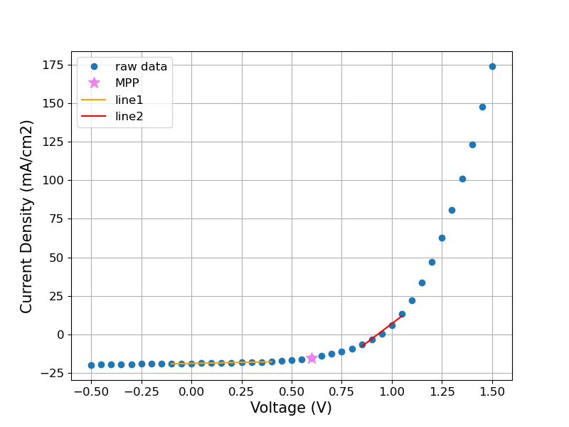

# About this project

During my PhD I measured the current-density vs. voltage curves for a wide variety of solar cells. Fortunately for me, someone else in my lab had previously setup a LabView program which not only captured the data, but also calculated the key solar cell performance parameters. What if this was not the case though? What if I was only able to gather the data, but had to do my own analysis on it to find its performance?

For this project I am trying to look at handling some of that data, fitting these data with a model, and extracting performance parameters of the cell.

At the top of my example datafile there are several lines that show the calculated parameters based on a LabView program in our lab. My goal will be to fit the data myself and match my own calculated parameters to this header. 

## Estimating performance using the ideal diode equation

$$J(V) = J_{D} (exp(A V) - 1) - J_{sc}$$

An example of the fitted data can be seen below:

As seen above, the fitted curve is less square-shaped than the raw data - meaning that the fit will underestimate the fill factor parameter of the solar cell. This issue will also end up under-estimating the open circuit voltage of the device as well. 

The predicted parameters are as follows:

If I take a ratio of these values with the expected parameters from the heading of my datafile, (calculated/expected), I get the following values for the three devices:

This shows how the model over-predicted the Jsc, but under-predicted the FF and Voc. This led to the overall efficiency to be lower than the expected value. 

## Estimating performance using simple linear fits

Perhaps the first method is over-complicating this process... As well, my devices are clearly not ideal diodes so perhaps using this equation to fit is not the best way to go. 

Now I will try a different, simpler method where I locate the maximum power point of the solar cell from the raw data alone, then fit two straight lines to either side of this point to estimate the parameters. This will allow me to calculate everything I need to determine its performance. Below is an example of the fitting used to estimate performance:

Within this curve I have highlighted the maximum power point (MPP) and shown the two lines used to estimate the following factors:
- Line1 : Jsc and Rsh
- Line2 : Voc and Rs

With this information and the MPP, I could easily calculate the FF and PCE of my solar cell. Below is the predicted performance for the three pixels:

If I take the ratio of this predicted data with the header in my file:

This method can predict most of the solar cell performance parameters with excellent accuracy - this must be the method that was used in my lab's LabView program! However, the resistances calculated with this method are significantly underestimated. 